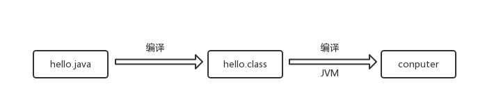

### JAVA 语言特点
- 跨平台（jvm编译）

- 面向对象：封装，继承，多态

- 编译加解释型

- 拥有较好的性能

- 健壮性（自带垃圾回收机制，由虚拟机负责内存垃圾的回收

- 多线程（拥有自己的多线程实现机制

- 安全性

### JVM （java virtual machine）
   >JVM就是java的虚拟机，为了支持java的跨平台特性 
   &#8195;class文件 ——————> JVM  ——————> 各个平台 

### java运行环境（jre）

#### java运行环境组成
   
- JVM 

- Runtime Interpreter
   
#### java运行环境的三项主要功能：
   
 - 加载代码：由Class Loader完成，将.class文件加载到虚拟机中
 
 - 校验代码：由Bytecode Verifier完成校验代码功能
 
 - Runtime Interpreter完成执行
   
 - java程序要执行，必须由JVM负责加载代码和校验代码，由Runtime Interpreter（运行时解释器）负责执行代码。
   java程序要执行依赖于jre。

#### JDK
 
 - JDK即Java Development Kit，就是java开发工具包。 
 
 - JDK比JRE多了Javac和java等众多命令。
   
### JAVA相关命令

- 编译命令

`javac XXX.java //XXX表示文件名`

- 运行命令

`java XXX //XXX表示文件名`

> 编译的是java文件，运行的是class文件，但在运行时不需要带文件后缀 
- 打包命令

`jar cvf XXX.jar XXX.class`
>可以将当前目录下的class文件打包成jar包文件 
 
- 生成API文档命令： 
 `javadoc XXX.java`
   
### [java帮助文档](https://www.oracle.com/technetwork/java/javaee/documentation/javaee7sdk-install-1957708.html)
   
   
    
     