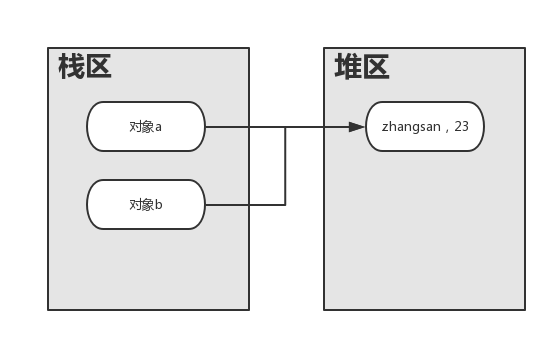
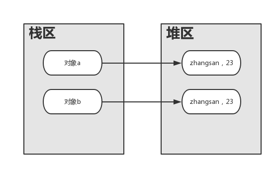

## 面向对象编程

### 面向对象

- 对象和类是面向对象方法的核心概念。

- 类是对相同或相似事物的一种抽象，描述了一类事物的共同特征。
  
- 对象是实际存在的某类事物的个体，也成为类的实例
  
- 属性是对象的静态特征；成员属性表示对象的属性或状态
  
- 方法是类的功能，类的功能只能通过方法来体现
  
- 参数列表用来告知方法执行所需的信息
   
### 重载

- 重载是一个类中多态性的一种体现（重载方法名相同参数不同）

>调用时：1.严格匹配 2.严格匹配找不到，自动转换再匹配

### 构造函数

- 定义

>与类名称同名的方法称为构造函数，它没有返回值

````
public class Person
{
    String name；
    int age;
    //1.无参构造函数
    public Person（）
    {
      System.out.println（"创建一个Person无参数"）
    }
    //2.有参的构造函数
    public Person（String name）
    {
      this.naem = name;
      System.out.println（"有参数的构造函数Name"）;
    }
    //3.有参的构造函数，名字和年龄一起创建
    public Person（String name，int age）
    {
        this（name）；
        this.age = age；
        System.out.println（"有参数的构造函数name age"）
    }
}
````

- 构造函数的使用

>构造函数通过new来进行调用，即通过 new Person（）这种形式调用。

- 栈区和堆区

>在java中，通过new运算符创建出的对象，都被放入到堆内存里。构造函数通过new来进行调用

>java不允许直接操作内存，所以向要操作内存，必须通过引用

### static关键字

- static属性

>static成员属于类所拥有。可以直接类名调用。

> static定义的是一块为整个类共有的一块存储区域，其中一个对象修改了，后面其他对象调用的时候会发现已经被修改了。

- static 方法

>可以通过static声明静态方法，静态方法又叫类方法。不需要生成对象，可以直接调用。

- 静态方法和静态属性的作用通常是为了提供共享的数据或工具方法。

- 静态方法和成员变量的关系

>  **在静态方法里面不能调用非静态的变量**

````
public class ClassTest
{
    private int a;
    public static void setA(int b)
    {
        a = b;
    }
}
//调用
ClassTest.setA(7);//->此处调用报错
````
> 上面代码有错误，错误原因在于静态方法中调用了非静态的变量a。

> 因为a是非静态的，只有创建了对象，才能引用它。

### 默认值

- 变量分为类成员变量和局部变量

- 类成员变量如果未赋初始值：

  > 引用类型初始化为null；
  
  > 基本数据类型初始化为0（布尔型为false）
 
- 如果定义在类中的局部变量（方法内部），在使用前必须初始化，否则编译不通过。
````
public class DefaultValue
{
    static byte x;
    int a;//成员变量未赋初始值，默认为0
    public int Test(int c)
    {
        int b = 0;//局部变量，必须先初始化才可以使用
        b = c;
        return b;
        
    }
}
````

### 初始化模块

- 初始化成员数据的方法

    - 在构造方法中设置值
    
    - 在声明中设置值
    
    - 通过初始化块设置值
    
- 初始化块

    - static类型的初始化块在加载class文件的时候执行，并且只执行一次
    
    - 非static类型的，在new对象的时候执行；new了几个对象，就执行几次

````
class AA
{
    int a = 4;//1.声明中设置值
    int b;
    static int c;
    public AA()
    {
        b = 200;//2.初始化块设置值
    }
    //初始化块 职责也是给成员变量赋值用的
    {
        b = 399;
        System.out.println("初始化块")
        //new了几个对象，就执行几次
    }
    static{
        c = 999;
        //静态初始化块的作用是：给static类型的成员变量赋值
        //在类加载的时候执行，并且只执行一次
    }
    
}
````
###对象克隆
````
Student s = new Student("zhangsan",23);
Student b = s;//这里只是对象b指向了s对象指向的堆栈地址
//因为Student是类，b = s，进行的是吧s的地址复制给了b，所以b也指向了s指向内存的同一个对象。
//克隆指的是把s指向内存的对象再复制一个，生成新地址，b指向新地址
````
> 对象赋值如图(Student b = s;) 



> 克隆期待结果



####浅克隆

#####要想实现一个类的对象呗复制，那么要实现以下步骤

- 实现Cloneable接口

- 重写Object类中的clone()方法，声明为public

- 在clone()方法中，调用super.clone()
